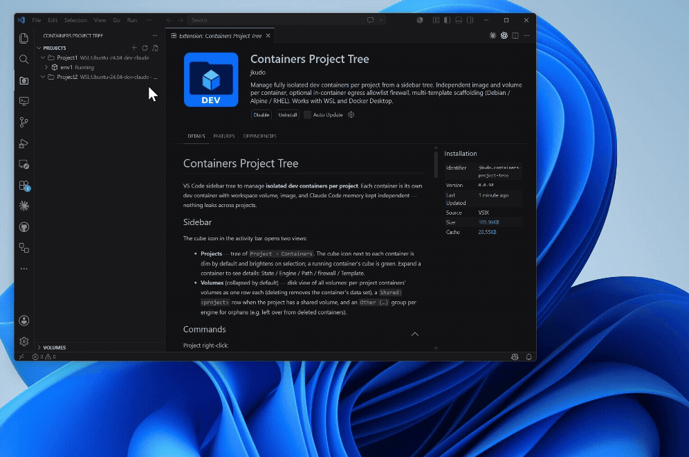

# Containers Project Tree

VS Code sidebar tree to manage **isolated dev containers per project**. Each container is its own dev container with workspace volume, image, and Claude Code memory kept independent — nothing leaks across projects.



## Sidebar

The cube icon in the activity bar opens two views:

- **Projects** — tree of `Project → Containers`. The cube icon next to each container is dim by default and brightens on selection; a running container's cube is green. Expand a container to see details: State / Engine / Path / firewall / Template.
- **Volumes** (collapsed by default) — disk view of all volumes: per-project containers' volumes as one row each (deleting removes the container's data set), a `Shared: <project>` row when the project has a shared volume, and an `Other (…)` group per engine for orphans (e.g. left over from deleted containers).

## Commands

Project right-click:
- **Add container** (also `+` on the row) — name + pick template
- **Toggle shared volume** — mount `<project>-shared` at `/shared` in every container of the project
- **Delete project** — choose whether to also delete the project's volumes / container images

Container right-click (or inline icons on hover):
- **Open** (terminal icon) — opens a new VS Code window auto-attached to the container
- **Stop** (red square, when running) — `docker stop`
- **Rebuild** — removes the container + its image, then re-opens (forces a clean rebuild against the current Dockerfile)
- **Firewall ON / OFF** — toggles the in-container egress allowlist. The menu label shows the *opposite* of the current state, i.e. the action it will perform
- **Re-apply template** — re-copy Dockerfile and/or `init-firewall.sh` from the container's chosen template (multi-select picker; each unchecked file is skipped)
- **Delete container** — choose whether to also delete its volumes / image

Projects view title bar:
- **New project** (`+`) — name + engine selection
- **Refresh** (`⟳`) — manual refresh. The view also auto-refreshes on focus/visibility and a 5s poll while focused
- **Manage templates…** — multi-template manager (see below)

## Templates

Each container is scaffolded from a template (Dockerfile + `init-firewall.sh`). Templates live at `<globalStorage>/templates/<name>/`. Three templates are bundled — pick the one that matches your base image:

| Template | OS family | Default base image |
|---|---|---|
| **`default`** | Debian / Ubuntu (apt-get) | `node:20` |
| **`alpine`**  | Alpine (apk, musl) | `node:20-alpine` |
| **`rhel`**    | RHEL / UBI / Rocky / Alma (dnf) | `registry.access.redhat.com/ubi9/nodejs-20` |

- All bundled templates **auto-sync from the extension** on every activate — treat them as mirrors, not editable.
- **New template…** copies an existing one to a new name. That copy is **not** touched by the auto-sync — customize freely there.
- The chosen template is recorded per container — **Re-apply template** uses the same one.
- Each template's container takes a **base image override** at creation (`baseImage` field in settings). The chosen value is **baked directly into the env's Dockerfile FROM line** (no `ARG`/build-arg indirection) — opening the env's Dockerfile shows the literal `FROM <chosen>`. Leave the InputBox blank to keep the template's default (`node:20` for `default` / `alpine`, `registry.access.redhat.com/ubi9/nodejs-20` for `rhel`).
- To change the base image of an existing container later: edit `baseImage` in settings → right-click the container → **Re-apply template** with the **Dockerfile** box checked → **Rebuild**. (The Dockerfile is re-rendered with the new `FROM` and the old image is dropped.)

## Engines

| Engine | Available on | Backend |
|---|---|---|
| `wsl` | Windows only | `wsl.exe -d <distro> docker …` (docker-ce inside the distro) |
| `local` | Windows / Mac | `docker …` directly (Docker Desktop) |

Engine is fixed at project level — every container of a project shares it.

## Isolation summary

- **Workspace data** per container: volume `<project>-<container>-src` mounted at `/workspace`. Host filesystem is not visible from inside.
- **User home** per container: a single hashed volume mounted at `/home/dev` covers everything under the dev user (Claude Code config / sessions / OAuth, bash history, `.ssh`, `.gitconfig`, tool caches, etc.) and survives Rebuild.
- **Shared volume** (optional, per project): `<project>-shared` at `/shared` across the project's containers — coherent only within one engine, so same-project containers always share an engine.
- **Egress firewall** (optional, default **OFF** for new containers): in-container iptables/ipset allowlist. Allowed by default: Anthropic (`api.anthropic.com`, `claude.ai`, `platform.claude.com`, `downloads.claude.ai`), OpenAI Codex, GitHub Copilot, Google Gemini, Cursor, Codeium / Windsurf, JetBrains AI / Junie, Amazon Kiro, GitHub IP ranges, npm registry, VS Code marketplace, plus telemetry (sentry / statsig). Container-scoped (in netns); the host network is untouched. Same enforcement on docker-ce and Docker Desktop.
- **Copilot instruction isolation**: per-container `.devcontainer/devcontainer.json` sets `useInstructionFiles: true`, `useCustomizationsInParentRepositories: false`, and zeroes the settings-based instruction arrays. Account-level personal instructions still apply server-side — don't put sensitive content there.

### Note on the shared `vscode` volume

A docker volume named `vscode` will appear in your engine after the first time you open any dev container. **It is created and managed by the Dev Containers extension (`ms-vscode-remote.remote-containers`), not by this extension**, and is mounted at `/vscode` in every dev container so VS Code Server (~100 MB) and its remote-side extensions don't have to be downloaded into each container. It is engine-wide (one `vscode` volume per docker engine, shared across all projects and containers — including ones not managed by this extension). It contains only the official VS Code Server binaries and extension cache; no project source, Claude state, API keys, shell history, or anything user-specific ever lands there. The per-container isolation above (workspace / home / firewall) is unaffected by it being shared.

## Reload behavior

- **Pure code changes** → **Developer: Reload Window** is enough.
- **`contributes` changes** (new view / new command / changed menu / title change) → fully **Quit and reopen** VS Code (Reload Window does NOT re-read these).

## Diagnostic

`verify-firewall.sh` — run inside a container (or pipe from host via `docker exec -u 0 <container> bash -s < verify-firewall.sh`) to check the in-container iptables allowlist works: dumps rules + ipset, then tries known-allowed and known-blocked egress (including raw IP `1.1.1.1` which is DNS-independent, isolating egress filtering from name resolution).

## Settings

Configuration key: `cpt.projects`. Typical entry:

```jsonc
{
  "cpt.projects": [
    {
      "name": "myapp",
      "engine": "wsl",
      "distro": "Ubuntu-24.04",
      "shared": true,
      "environments": [
        {
          "label": "api",
          "engine": "wsl",
          "distro": "Ubuntu-24.04",
          "path": "/home/dev/projects/myapp/api",
          "firewall": "off",
          "template": "default"
        }
      ]
    }
  ]
}
```
